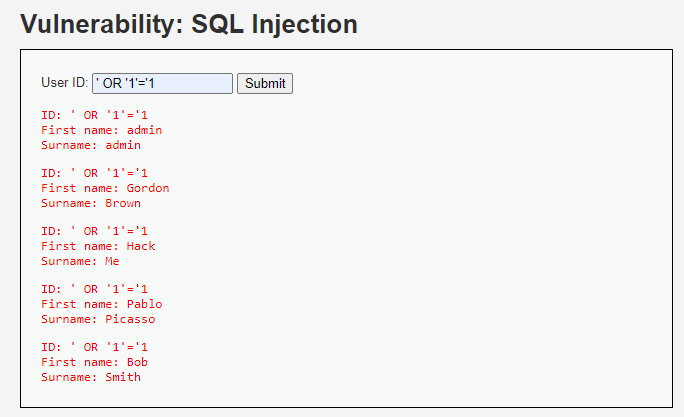
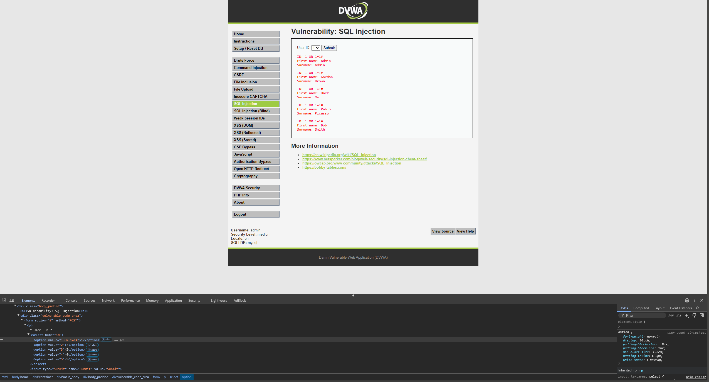

# Raport: SQL Injection pe Nivelul LOW din DVWA

## Introducere
Acest raport prezintă vulnerabilitatea SQL Injection pe nivelul de securitate "LOW" din aplicația Damn Vulnerable Web Application (DVWA). DVWA este utilizat pentru învățarea vulnerabilităților comune de securitate web, iar nivelul "LOW" reprezintă un scenariu cu protecții minime. Vom analiza cum se poate exploata această vulnerabilitate și impactul asupra securității aplicației.

## Descrierea Vulnerabilității
La nivelul de securitate "LOW", formularul de căutare a utilizatorilor din DVWA nu filtrează corespunzător inputul primit de la utilizator. Această lipsă de filtrare permite unui atacator să injecteze cod SQL malițios direct într-o interogare SQL, ceea ce poate duce la divulgarea datelor din baza de date.

## Pașii de Exploatare
### 1. Navigarea la Secțiunea de SQL Injection
Pentru a exploata vulnerabilitatea, utilizatorul navighează la secțiunea **SQL Injection** din meniul principal DVWA. Aici, aplicația oferă un formular prin care se poate căuta un utilizator prin introducerea unui ID numeric.

### 2. Injectarea Codului SQL
Pentru a exploata vulnerabilitatea, se introduce în câmpul de ID următoarea instrucțiune:

```sql
' OR '1'='1
```




Această instrucțiune face ca interogarea SQL să devină adevărată pentru toate întrările din tabel, determinând astfel afișarea tuturor utilizatorilor din baza de date.

### 3. Explicație Tehnică
Codul SQL injectat modifică interogarea astfel:

```sql
SELECT * FROM users WHERE id = '' OR '1'='1';
```

- **`' OR '1'='1`**: Această condiție face ca partea de WHERE a interogării să fie mereu adevărată, ceea ce determină afișarea tuturor rândurilor din tabelul "users".
- Din cauza lipsei validării inputului, interogarea originală este compromisă, permițând atacatorului să obțină acces la toate datele stocate.

## Impactul Vulnerabilității
Exploatarea vulnerabilității SQL Injection la nivelul "LOW" are următoarele consecințe:
- Afișarea tuturor utilizatorilor și a informațiilor lor, inclusiv date sensibile.
- Posibilitatea atacatorului de a modifica interogarea SQL, ceea ce poate duce la coruperea datelor sau la compromiterea completă a bazei de date.

Această vulnerabilitate ar putea fi folosită de un atacator pentru a obține acces neautorizat la informații sensibile, afectând confidențialitatea și integritatea datelor.

## Recomandări pentru Prevenire
Pentru a preveni vulnerabilități de tip SQL Injection, se recomandă următoarele măsuri de securitate:
1. **Utilizarea Interogărilor Pregătite (Prepared Statements)**: Aceasta ajută la separarea codului SQL de inputul utilizatorului, prevenind injectarea de cod malițios.
2. **Validarea Inputului Utilizatorului**: Filtrarea și validarea inputului pentru a se asigura că nu conține caractere periculoase.
3. **Utilizarea unui ORM (Object-Relational Mapping)**: Un ORM poate ajuta la gestionarea interacțiunilor cu baza de date într-un mod mai sigur.

# Raport: SQL Injection pe Nivelul MEDIUM din DVWA

## Introducere
Acest raport explică cum se poate exploata vulnerabilitatea SQL Injection la nivelul de securitate "MEDIUM" din Damn Vulnerable Web Application (DVWA). Nivelul "MEDIUM" prezintă unele măsuri de protecție pentru a preveni atacurile SQL Injection, dar acestea pot fi ocolite prin diverse tehnici. Vom analiza modul în care am modificat valoarea unui input HTML pentru a accesa datele din baza de date.

## Descrierea Vulnerabilității
La nivelul "MEDIUM" din DVWA, aplicația implementează o protecție minimă care folosește funcții precum `mysql_real_escape_string()` pentru a filtra anumite caractere speciale. Totuși, această filtrare nu este suficientă pentru a preveni complet atacurile SQL Injection. Vulnerabilitatea poate fi exploatată prin modificarea directă a codului HTML al formularului utilizând consola browserului.

## Pașii de Exploatare
### 1. Navigarea la Secțiunea de SQL Injection
Pentru a exploata vulnerabilitatea, am navigat la secțiunea **SQL Injection** din meniul principal DVWA. Aici, aplicația oferă un formular prin care se poate căuta un utilizator prin introducerea unui ID numeric.

### 2. Modificarea HTML-ului Formularului
Pentru a ocoli măsurile de protecție la nivelul "MEDIUM", am deschis consola browserului (F12) și am modificat manual valoarea unui input din formular. În specific, am schimbat valoarea atributului `value` la una dintre opțiuni astfel:

```html
value="1 OR 1=1#"
```



### 3. Executarea Atacului
După ce am modificat valoarea inputului, am trimis formularul, iar serverul a returnat toate datele din baza de date a utilizatorilor.

### Explicație Tehnică
Instrucțiunea modificată `1 OR 1=1#` funcționează astfel:
- **`1 OR 1=1`**: Această condiție face ca partea de WHERE a interogării să fie mereu adevărată, deoarece `1=1` este întotdeauna adevărat.
- **`#`**: Acesta marchează începutul unui comentariu în SQL, ceea ce înseamnă că restul interogării va fi ignorat.

Interogarea SQL modificată devine astfel:

```sql
SELECT * FROM users WHERE id = '1 OR 1=1#';
```

Acest lucru face ca serverul să ignore orice alte condiții și să returneze toate rândurile din tabelul "users".

## Impactul Vulnerabilității
Exploatarea vulnerabilității SQL Injection la nivelul "MEDIUM" are următoarele consecințe:
- Afișarea tuturor utilizatorilor și a informațiilor lor, inclusiv date sensibile.
- Posibilitatea atacatorului de a obține acces neautorizat la informații confidențiale, compromițând astfel confidențialitatea datelor.

Această vulnerabilitate poate fi folosită de un atacator pentru a compromite baza de date și a accesa informații fără autorizație.

## Recomandări pentru Prevenire
Pentru a preveni vulnerabilități de tip SQL Injection, se recomandă următoarele măsuri de securitate:
1. **Utilizarea Interogărilor Pregătite (Prepared Statements)**: Acestea ajută la separarea codului SQL de inputul utilizatorului, prevenind astfel injectarea de cod malițios.
2. **Validarea și Escaparea Inputului Utilizatorului**: Filtrarea și validarea inputului pentru a se asigura că nu conține caractere periculoase.
3. **Utilizarea unui ORM (Object-Relational Mapping)**: Un ORM poate ajuta la gestionarea interacțiunilor cu baza de date într-un mod mai sigur.


