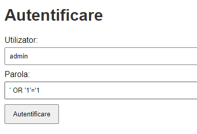
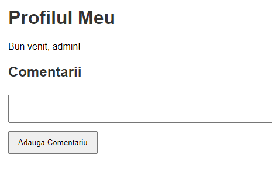
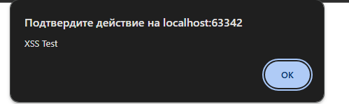
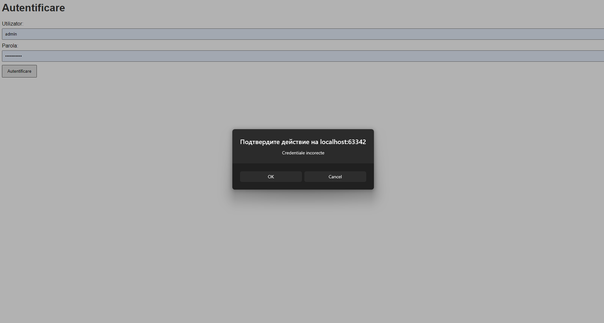
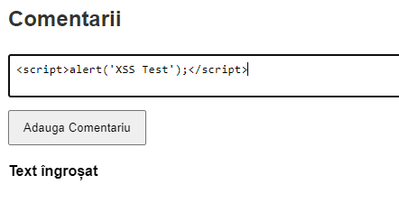
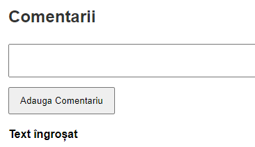

# Raport de Proiect: Crearea și Securizarea unei Aplicații Web Vulnerabile la SQL Injection și XSS

## Introducere

Acest raport detaliază procesul de dezvoltare a unei aplicații web vulnerabile la atacuri de tip SQL Injection și Cross-Site Scripting (XSS), demonstrarea acestor vulnerabilități și implementarea măsurilor de securitate pentru a le preveni. Scopul principal al acestui proiect este de a înțelege modul în care apar aceste vulnerabilități și cum pot fi remediate pentru a asigura securitatea aplicațiilor web.

---

## Obiective

1. **Înțelegerea vulnerabilităților la SQL Injection și XSS**: Analiza modului în care input-urile nesecurizate pot fi exploatate pentru a compromite o aplicație web.
2. **Dezvoltarea unei aplicații web vulnerabile**: Crearea unei aplicații cu un formular de autentificare și afișarea datelor dintr-o bază de date, care este susceptibilă la atacuri.
3. **Demonstrarea vulnerabilităților**: Efectuarea de teste care evidențiază cum pot fi exploatate vulnerabilitățile pentru a accesa date sensibile sau a executa cod malițios.
4. **Securizarea aplicației**: Implementarea măsurilor de securitate necesare pentru a preveni atacurile de tip SQL Injection și XSS.
5. **Analiza comportamentului aplicației înainte și după securizare**: Compararea funcționalității și securității aplicației în cele două etape.

---

## Tehnologii Utilizate

- **Backend**:
    - Node.js
    - Express.js
    - PostgreSQL
- **Frontend**:
    - HTML5
    - CSS3
    - JavaScript
- **Biblioteci și Module**:
    - `pg` pentru interacțiunea cu PostgreSQL
    - `body-parser` pentru parsarea request-urilor
    - `cors` pentru a permite accesul cross-origin
    - `helmet` pentru setarea header-elor de securitate
    - `sanitize-html` pentru sanitizarea input-urilor

---

## Structura Proiectului

```
proiect/
├── backend/
│   ├── server.js
│   ├── routes/
│   │   ├── auth.js
│   │   └── data.js
│   ├── controllers/
│   │   ├── authController.js
│   │   └── dataController.js
│   ├── models/
│   │   └── db.js
│   ├── package.json
│   └── package-lock.json
├── frontend/
│   ├── index.html
│   ├── login.html
│   ├── profile.html
│   ├── scripts/
│   │   └── main.js
│   └── styles/
│       └── styles.css
└── README.md
```

---

## Implementarea Aplicației Vulnerabile

### Backend

#### 1. Configurarea Serverului Express (`server.js`)

```javascript
// backend/server.js
const express = require('express');
const bodyParser = require('body-parser');
const cors = require('cors');
const helmet = require('helmet');

const authRoutes = require('./routes/auth');
const dataRoutes = require('./routes/data');

const app = express();

// Middleware-uri
app.use(helmet());
app.use(bodyParser.json());
app.use(cors());

// Rute
app.use('/auth', authRoutes);
app.use('/data', dataRoutes);

// Pornirea serverului
const PORT = process.env.PORT || 3000;
app.listen(PORT, () => {
  console.log(`Serverul rulează pe portul ${PORT}`);
});
```

#### 2. Conexiunea la Baza de Date (`models/db.js`)

```javascript
// backend/models/db.js
const { Pool } = require('pg');

const pool = new Pool({
  user: 'utilizator',
  host: 'localhost',
  database: 'nume_baza_date',
  password: 'parola',
  port: 5432,
});

module.exports = pool;
```

#### 3. Rutele de Autentificare și Manipulare a Datelor

- **Autentificare (`routes/auth.js` și `controllers/authController.js`)**

  ```javascript
  // backend/routes/auth.js
  const express = require('express');
  const router = express.Router();
  const authController = require('../controllers/authController');

  router.post('/login', authController.login);

  module.exports = router;
  ```

  ```javascript
  // backend/controllers/authController.js
  const pool = require('../models/db');

  // Funcție vulnerabilă la SQL Injection
  exports.login = async (req, res) => {
    const { username, password } = req.body;
    try {
      const query = `SELECT * FROM users WHERE username = '${username}' AND password = '${password}'`;
      const result = await pool.query(query);
      if (result.rows.length > 0) {
        res.json({ success: true, user: result.rows[0] });
      } else {
        res.json({ success: false, message: 'Credentiale incorecte' });
      }
    } catch (err) {
      res.status(500).json({ error: err.message });
    }
  };
  ```

- **Manipularea Datelor (`routes/data.js` și `controllers/dataController.js`)**

  ```javascript
  // backend/routes/data.js
  const express = require('express');
  const router = express.Router();
  const dataController = require('../controllers/dataController');

  router.get('/items', dataController.getData);
  router.post('/items', dataController.addData);

  module.exports = router;
  ```

  ```javascript
  // backend/controllers/dataController.js
  const pool = require('../models/db');

  exports.getData = async (req, res) => {
    try {
      const result = await pool.query('SELECT * FROM data_table');
      res.json(result.rows);
    } catch (err) {
      res.status(500).json({ error: err.message });
    }
  };

  // Funcție vulnerabilă la XSS
  exports.addData = async (req, res) => {
    const { content } = req.body;
    try {
      const query = `INSERT INTO data_table (content) VALUES ('${content}')`;
      await pool.query(query);
      res.json({ success: true, message: 'Datele au fost adăugate' });
    } catch (err) {
      res.status(500).json({ error: err.message });
    }
  };
  ```

### Frontend

#### 1. Pagini HTML și Scripturi JavaScript

- **Pagina de Autentificare (`login.html`)**

  ```html
  <!-- frontend/login.html -->
  <!DOCTYPE html>
  <html>
  <head>
    <title>Autentificare</title>
    <link rel="stylesheet" href="styles/styles.css">
  </head>
  <body>
    <h1>Autentificare</h1>
    <form id="loginForm">
      <label for="username">Utilizator:</label>
      <input type="text" id="username" name="username" required><br>
      <label for="password">Parolă:</label>
      <input type="password" id="password" name="password" required><br>
      <button type="submit">Autentificare</button>
    </form>
    <script src="scripts/main.js"></script>
  </body>
  </html>
  ```

- **Pagina de Profil și Comentarii (`profile.html`)**

  ```html
  <!-- frontend/profile.html -->
  <!DOCTYPE html>
  <html>
  <head>
    <title>Profilul Meu</title>
    <link rel="stylesheet" href="styles/styles.css">
  </head>
  <body>
    <h1>Profilul Meu</h1>
    <div id="userInfo"></div>
    <h2>Comentarii</h2>
    <form id="commentForm">
      <textarea id="content" name="content" required></textarea><br>
      <button type="submit">Adaugă Comentariu</button>
    </form>
    <div id="comments"></div>
    <script src="scripts/main.js"></script>
  </body>
  </html>
  ```

- **Scriptul Principal (`scripts/main.js`)**

  ```javascript
  // frontend/scripts/main.js

  // Gestionarea autentificării
  const loginForm = document.getElementById('loginForm');
  if (loginForm) {
    loginForm.addEventListener('submit', async (e) => {
      e.preventDefault();
      const username = document.getElementById('username').value;
      const password = document.getElementById('password').value;

      const response = await fetch('http://localhost:3000/auth/login', {
        method: 'POST',
        headers: {
          'Content-Type': 'application/json',
        },
        body: JSON.stringify({ username, password }),
      });

      const data = await response.json();
      if (data.success) {
        localStorage.setItem('user', JSON.stringify(data.user));
        window.location.href = 'profile.html';
      } else {
        alert(data.message);
      }
    });
  }

  // Gestionarea comentariilor
  const userInfo = document.getElementById('userInfo');
  const commentsDiv = document.getElementById('comments');
  const commentForm = document.getElementById('commentForm');

  if (userInfo && commentsDiv && commentForm) {
    const user = JSON.parse(localStorage.getItem('user'));
    if (user) {
      userInfo.innerHTML = `<p>Bun venit, ${user.username}!</p>`;
    } else {
      window.location.href = 'login.html';
    }

    // Obținerea comentariilor
    const getComments = async () => {
      const response = await fetch('http://localhost:3000/data/items');
      const data = await response.json();
      commentsDiv.innerHTML = '';
      data.forEach((item) => {
        const p = document.createElement('p');
        p.innerHTML = item.content; // Posibil vulnerabil la XSS
        commentsDiv.appendChild(p);
      });
    };

    getComments();

    // Adăugarea unui comentariu
    commentForm.addEventListener('submit', async (e) => {
      e.preventDefault();
      const content = document.getElementById('content').value;

      await fetch('http://localhost:3000/data/items', {
        method: 'POST',
        headers: {
          'Content-Type': 'application/json',
        },
        body: JSON.stringify({ content }),
      });

      document.getElementById('content').value = '';
      getComments();
    });
  }
  ```

#### 2. Stilizare CSS (`styles/styles.css`)

```css
/* frontend/styles/styles.css */
body {
  font-family: Arial, sans-serif;
  margin: 20px;
}

h1, h2 {
  color: #333;
}

form {
  margin-bottom: 20px;
}

label {
  display: block;
  margin-top: 10px;
}

input, textarea {
  width: 100%;
  padding: 8px;
  margin-top: 5px;
}

button {
  margin-top: 10px;
  padding: 10px 15px;
}
```

### Baza de Date PostgreSQL

- **Crearea Tabelelor**

  ```sql
  CREATE TABLE users (
    id SERIAL PRIMARY KEY,
    username VARCHAR(50) UNIQUE NOT NULL,
    password VARCHAR(50) NOT NULL
  );

  CREATE TABLE data_table (
    id SERIAL PRIMARY KEY,
    content TEXT NOT NULL
  );

  INSERT INTO users (username, password) VALUES ('admin', 'admin123');
  ```

---

## Demonstrând Vulnerabilitățile

### 1. SQL Injection

#### 1.1. Vulnerabilitatea

Aplicația permite injectarea de cod SQL prin concatenarea directă a input-urilor utilizatorului în interogările SQL.

#### 1.2. Demonstrarea Vulnerabilității

- **Pasul 1**: Accesați formularul de autentificare (`login.html`).
- **Pasul 2**: În câmpul **username**, introduceți:

  ```
  ' OR '1'='1
  ```

- **Pasul 3**: Lăsați câmpul **password** gol sau introduceți orice valoare.
- **Pasul 4**: Trimiteți formularul.
- **Rezultat**: Autentificarea are succes, deși nu ați introdus credențiale valide.

#### 1.3. Explicație

Interogarea SQL devine:

```sql
SELECT * FROM users WHERE username = '' OR '1'='1' AND password = '';
```

Condiția `'1'='1'` este întotdeauna adevărată, permițând accesul neautorizat.

### 2. Cross-Site Scripting (XSS)

#### 2.1. Vulnerabilitatea

Aplicația afișează conținutul introdus de utilizatori fără a-l sanitiza, permițând executarea de cod JavaScript malițios.

#### 2.2. Demonstrarea Vulnerabilității

- **Pasul 1**: Autentificați-vă cu un cont valid (`admin` / `admin123`).
- **Pasul 2**: În formularul de comentarii, introduceți:

  ```html
  <script>alert('XSS Vulnerability');</script>
  ```

- **Pasul 3**: Trimiteți comentariul.
- **Rezultat**: Un mesaj de alertă apare, demonstrând executarea codului injectat.

#### 2.3. Explicație

Codul JavaScript este interpretat și executat de browser, ceea ce poate fi exploatat pentru diverse atacuri.

---

## Securizarea Aplicației

### 1. Prevenirea SQL Injection

- **Modificarea interogărilor pentru a folosi parametri parametrizați**:

  ```javascript
  // backend/controllers/authController.js
  exports.login = async (req, res) => {
    const { username, password } = req.body;
    try {
      const query = 'SELECT * FROM users WHERE username = $1 AND password = $2';
      const values = [username, password];
      const result = await pool.query(query, values);
      if (result.rows.length > 0) {
        res.json({ success: true, user: result.rows[0] });
      } else {
        res.json({ success: false, message: 'Credentiale incorecte' });
      }
    } catch (err) {
      res.status(500).json({ error: err.message });
    }
  };
  ```

### 2. Prevenirea XSS

- **Sanitizarea input-urilor utilizatorului folosind `sanitize-html`**:

  ```javascript
  // backend/controllers/dataController.js
  const sanitizeHtml = require('sanitize-html');

  exports.addData = async (req, res) => {
    let { content } = req.body;
    content = sanitizeHtml(content);
    try {
      const query = 'INSERT INTO data_table (content) VALUES ($1)';
      const values = [content];
      await pool.query(query, values);
      res.json({ success: true, message: 'Datele au fost adăugate' });
    } catch (err) {
      res.status(500).json({ error: err.message });
    }
  };
  ```

- **Utilizarea `textContent` în loc de `innerHTML` pe partea de client**:

  ```javascript
  // frontend/scripts/main.js
  p.textContent = item.content; // Înlocuiește innerHTML cu textContent
  ```

---

## Verificarea Măsurilor de Securitate

### 1. Testarea Prevenirii SQL Injection

- **Repetarea testului anterior**:
    - Introduceți `' OR '1'='1` în câmpul **username**.
    - **Rezultat**: Autentificarea eșuează, afișând mesajul "Credentiale incorecte".
  
     

### 2. Testarea Prevenirii XSS

- **Repetarea testului anterior**:
    - Introduceți `<script>alert('XSS Test');</script>` în comentariu.
    - **Rezultat**: 

---

## Analiza Diferențelor și Explicații Tehnice

### 1. Diferențe în Comportamentul Aplicației

- **Înainte de securizare**:
    - Aplicația era vulnerabilă la SQL Injection și XSS.
    - Atacatorii puteau obține acces neautorizat și executa cod malițios.
- **După securizare**:
    - Vulnerabilitățile au fost remediate.
    - Input-urile utilizatorilor sunt gestionate în siguranță.
  
   

### 2. Explicații Tehnice

- **SQL Injection**:
    - **Problema**: Concatenația directă a input-urilor în interogări SQL.
    - **Soluția**: Utilizarea interogărilor parametrizate (`$1`, `$2`), care separă codul SQL de date.
- **XSS**:
    - **Problema**: Afișarea nesecurizată a conținutului utilizatorilor în pagini web.
    - **Soluția**: Sanitizarea input-urilor cu `sanitize-html` și afișarea datelor folosind `textContent`.

---